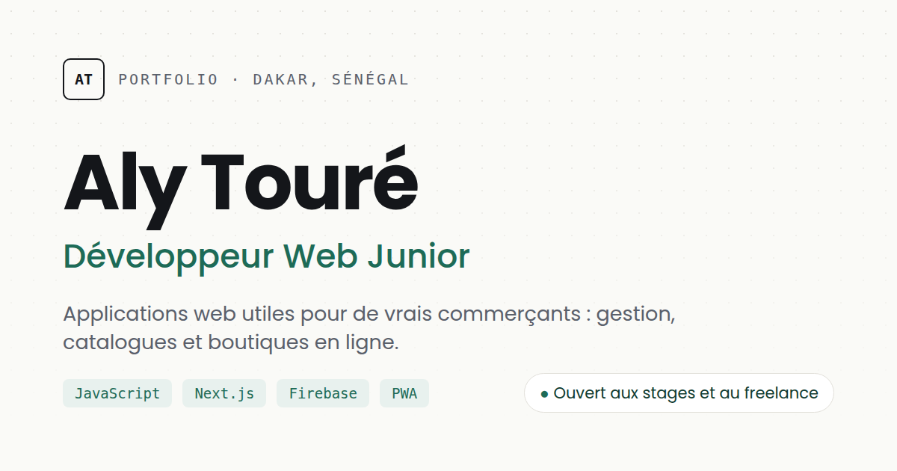

# Aly Touré — Portfolio

Portfolio de **Aly Touré**, développeur web junior à Dakar, étudiant en Licence 2 Mathématiques – Physique – Informatique à l'UCAD.

**Site en ligne : https://alytoure700-pixel.github.io/aly-portfolio/**



## Contenu

- **Projets** : SAMA-COMMERCE (application de gestion pour commerçants, avec démo), Cheikh Telecom, Saloum-Sen Boutique et ABG, présentés sous la forme problème → solution.
- **Pour les commerçants** : présentation de SAMA-COMMERCE, avec contact direct sur WhatsApp.
- **À propos, Compétences, Méthode, Parcours et Contact**.
- **CV** téléchargeable en PDF.

## Choix techniques

- **HTML, CSS et JavaScript**, sans framework ni bibliothèque : le site est une seule page statique, rien ne justifiait une étape de compilation.
- **Données séparées de l'affichage** : les projets, compétences, liens et le parcours sont dans `js/data.js`, et `js/render.js` génère le HTML correspondant. Ajouter un projet revient à ajouter un bloc dans `data.js`.
- **Variables CSS** (`css/variables.css`) pour les couleurs, les polices et les espacements, avec un **mode sombre automatique**.
- **Accessibilité** : HTML sémantique, navigation au clavier, lien d'évitement, contrastes vérifiés (AA), prise en compte de `prefers-reduced-motion`.
- **Performance** : images en WebP, chargement différé (`loading="lazy"`), environ 600 Ko au total.
- **SEO** : balises Open Graph avec image de partage et données structurées (schema.org).

## Structure

```
index.html          Structure et textes de la page
css/variables.css   Couleurs, polices, espacements
css/base.css        Styles généraux et boutons
css/sections.css    Styles de chaque section
js/data.js          Contenu modifiable (projets, liens, parcours…)
js/render.js        Génère les sections à partir de data.js
js/main.js          Menu mobile, lien actif, animations
assets/             Images, CV, icônes
```

## Lancer en local

Aucune installation nécessaire : ouvrir `index.html` dans un navigateur.

## Contact

- Email : alytoure700@gmail.com
- LinkedIn : https://www.linkedin.com/in/aly-tour%C3%A9-a20b0b43a/
- WhatsApp : +221 78 387 34 91
